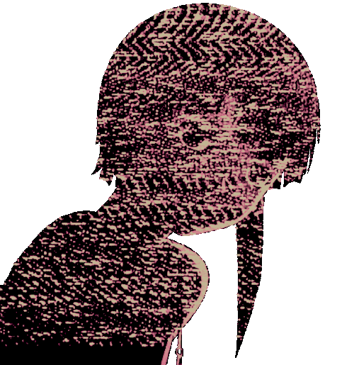

  
  
  

 

<h2 align="center">  <em>Sobre eu </em></h2>

 

 

  Ola! Meu nome é <em><b> Gabriel Rufino</b></em>, e sou estudante de Engenharia de Software. Tenho interesse em tecnologia e resolução de problemas, e estou constantemente buscando evoluir minhas habilidades na área de desenvolvimento. Atualmente, estou trabalhando em projetos práticos para consolidar meus conhecimentos e adquirir experiência.

 

      <em><b>  Aluno de Engenharia de Software na Univassouras </b></em>  

 
 
<h2 align="center">  <em> Tecnologias </em> </h2>

  
  
  
  
  

 

<h2 align="center"">  <em> Statistics </em> </h2>

 

<picture>
  <source media="(prefers-color-scheme: dark)" srcset="https://raw.githubusercontent.com/rufigab/rufigab/output/pacman-contribution-graph-dark.svg">
  <source media="(prefers-color-scheme: light)" srcset="https://raw.githubusercontent.com/rufigab/rufigab/output/pacman-contribution-graph.svg">
  
</picture>

